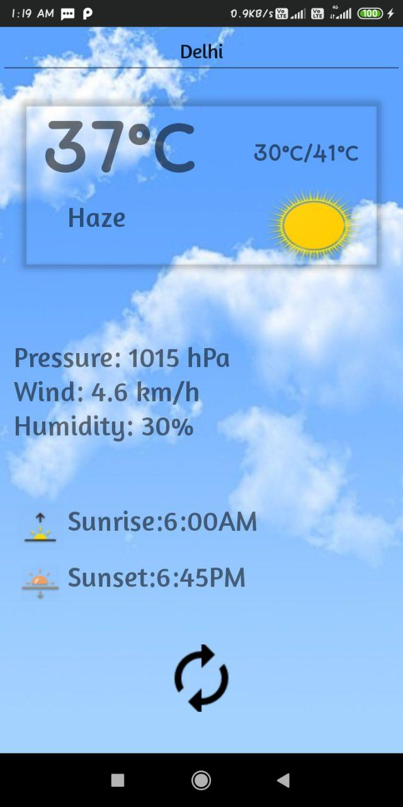

# Weather-1.0
With a simple UI and awesome performance this weather 1.0 let you know weather details like Temperature, humidity, wind speed, sunset-sunrise time,etc
I have used CardView, JSON API and Volley library.

  
